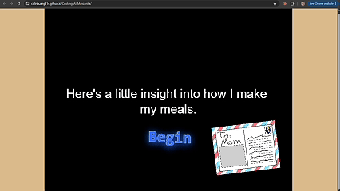

# Cooking at Manzanita

A cozy, cooking-themed typing game I designed and built in Phaser as a gift for my mom. 🍳
Includes colorful scenes and animations, every sprite, background, and sound effect was hand-drawn or recorded by me.
**[▶ Play it in your browser](https://colinhuang314.github.io/Cooking-At-Manzanita/)**

\
\
Example Scenes:
\

